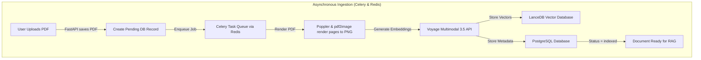

# Multimodal Page-as-Image RAG Backend & Frontend

An enterprise-ready, high-performance asynchronous REST API and React-based web UI for Conversational Multimodal Retrieval-Augmented Generation (RAG) using the **Page-as-Image** paradigm.

Built with **FastAPI**, **LlamaIndex**, **Voyage AI**, **Gemini 1.5/2.5 Flash**, **LanceDB**, **Celery**, and a **React + TypeScript + Vite** frontend, this monorepo indexes PDF documents by rendering every page as a high-resolution image and embedding it directly. This bypasses the typical text extraction bottlenecks of standard RAG (e.g., losing tables, diagrams, formatting, and mathematical equations) by treating document pages visually.

---

## What is "Page-as-Image" Multimodal RAG? (Layman-Friendly)

### The Problem with Traditional RAG
When you upload a PDF to a traditional chat system (like a standard PDF chatbot), the computer tries to read it by converting the document to plain text. If your document has:
- **Financial charts and bar graphs**
- **Complex tables and cell alignments**
- **Mathematical equations and scientific symbols**
- **Flowcharts, diagrams, or images**

...a traditional system will either completely ignore them or read them as garbled text, losing crucial context.

### The "Page-as-Image" Solution
Instead of parsing PDFs as plain text, this project takes a visual approach:
1. **Take a Picture**: The system splits your PDF and renders each page into a high-quality image (like a screenshot).
2. **Visual Memory**: It runs these screenshots through Voyage AI's multimodal embedding model to create "visual descriptions" (vectors) of each page.
3. **Smart Search**: When you ask a question (e.g., *"Show me the trend of revenue in Q3"*), it searches these visual descriptions to find the pages that contain the answer.
4. **Visual Synthesis**: It retrieves the actual images of the matching pages and passes them directly to Google's **Gemini** (a multimodal model that has "eyes"). Gemini looks at the page layout, charts, and tables to write a highly accurate answer, complete with page citations!

---

## System Architecture & Data Flow

Below is the end-to-end architecture showing the separation of concerns between the **Asynchronous Ingestion Pipeline** (handled in background workers) and the **RAG Query Pipeline** (handled in FastAPI):

### Ingestion Pipeline


### Query Pipeline

```mermaid
graph TD
    subgraph QueryPipeline["Conversational Multimodal RAG"]
        I[User Sends Query / Chat] -->|FastAPI| J[Fetch Chat Session & History]
        J -->|Embed Text Query| K[Voyage Text Embedder]
        K -->|Vector Search| L[LanceDB Similarity Match]
        L -->|Fetch Top-K Page Images| M[Retrieve Page Screenshot Paths]
        M -->|Construct Prompt with Images + Context + History| N[Gemini Multimodal Client]
        N -->|Generate Answer| O[Process Token Usage & Latency]
        O -->|Save Message & Citations| P[PostgreSQL Metadata & History]
        P -->|Return Response| Q[User Chat UI]
    end
```


---

## Tech Stack & Engineering Decisions

| Component | Technology | Rationale & Engineering Details |
|---|---|---|
| **API Framework** | **FastAPI** `0.136.3` | High performance, fully asynchronous (using `async/await`), automatic OpenAPI documentation generation, and native integration with modern Python async database libraries. |
| **Orchestration** | **LlamaIndex** `0.14.22` | Industry-standard LLM and vector store interface wrapper, easing integration of Voyage AI, Gemini, and LanceDB. |
| **Vector Store** | **LanceDB** `0.33.0` | Serverless, disk-based vector database. Offers lightning-fast cosine similarity search on local file structures. Index creation is deferred until initial data ingestion to bypass empty-table schema constraints. |
| **Embeddings** | **Voyage Multimodal 3.5** | Top-performing multimodal embedding model. Projects both text queries and raw images (represented as PIL images) into the same shared `1024-dimensional` vector space. |
| **LLM Model** | **Gemini 1.5 / 2.5 Flash** | Chosen for its massive context window, exceptional multimodal (image + text) performance, low latency, and native support for interleaved image and text inputs via the official `google-genai` SDK. |
| **Metadata Store** | **PostgreSQL** | Relational store for sessions, chat messages, page metadata, and citation tracking. Interfaced using **SQLAlchemy 2.0** (Async API) and mapped with **Alembic** migrations. |
| **Background Tasks** | **Celery** + **Redis** | Decouples heavy rendering (pdf2image) and batch embedding operations from the API event loop. Concurrency is limited to **1** due to LanceDB's single-writer locking constraints. |
| **PDF Rendering** | **pdf2image** + **Poppler** | Compiles PDFs into high-fidelity rasterized PNG images at configurable DPI resolution, optimizing them for visual comprehension by the embedding model. |

---

## Key Technical Highlights

- **Asynchronous Design**: The entire API layer is non-blocking. Database operations are handled using SQLAlchemy's async interface (`asyncpg` adapter), and long-running PDF parsing is delegated to Celery.
- **LanceDB Concurrency Handling**: Configured with a Celery concurrency limits mechanism (`concurrency=1` on writing tasks) to prevent DB locking issues.
- **Deferred Indexing**: Prevents vector store errors by waiting to call LanceDB's `create_index` until data exists in the table.
- **Stateful Conversational Memory**: Manages chat sessions in PostgreSQL, keeping track of preceding messages and injecting context dynamically into Gemini's multi-turn conversational interface.
- **Robust Exception Handling**: Global HTTP handlers manage upstream API failures (Gemini/Voyage), database errors, and document-readiness states, returning clean JSON payloads.

---

## Project Structure

```
├── backend/
│   ├── app/               # FastAPI application (routers, services, core logic)
│   │   ├── api/           # API endpoints for chat, documents, and health
│   │   ├── core/          # Embedding, LLM, RAG, render, and vector store logic
│   │   ├── db/            # Database session management
│   │   ├── models/        # SQLAlchemy models and Pydantic schemas
│   │   └── services/      # Business logic for chat and documents
│   ├── tasks/             # Celery worker entrypoints and background jobs
│   ├── alembic/           # Database migrations scripts
│   ├── tests/             # Backend integration and unit tests
│   ├── Dockerfile         # Production-grade multi-stage Docker build
│   └── docker-compose.yml # Local orchestration for API, Redis, Celery, Postgres
├── frontend/
│   ├── src/               # React + TypeScript application source
│   │   ├── components/    # UI components for chat, documents, layout, and shared UI
│   │   │   ├── pages/     # Route-level pages
│   │   │   └── ui/        # Reusable UI primitives
│   │   ├── context/       # React context providers
│   │   ├── hooks/         # Custom React hooks
│   │   ├── lib/           # API client and utility helpers
│   │   └── types/         # Shared TypeScript types
│   ├── package.json       # Frontend dependencies and scripts
│   ├── vite.config.ts    # Vite config and API proxy settings
│   └── index.html         # Frontend entry page
└── README.md
```

---

## Quick Start & Setup

### Prerequisites
- Docker & Docker Compose installed.
- Voyage AI API Key ([Voyage AI](https://www.voyageai.com/)).
- Google Gemini API Key ([Google AI Studio](https://aistudio.google.com/)).

### 1. Setup Environment Variables
Clone the `.env.example` template into `.env`:
```bash
cp .env.example .env
```
Open `.env` and fill in your API keys:
```env
VOYAGE_API_KEY=your_voyage_api_key_here
GEMINI_API_KEY=your_gemini_api_key_here
```

### 2. Launch Services with Docker
Run the backend service stack (FastAPI web server, Celery worker, Redis queue, PostgreSQL database, and LanceDB volume mount) from the backend folder:
```bash
cd backend
docker-compose up --build
```

### 3. Run Database Migrations
Initialize the schema and tables in the PostgreSQL container:
```bash
cd backend
docker-compose exec api alembic upgrade head
```

### 4. Run the Frontend (Development Mode)
The React frontend can be started separately for local development:
```bash
cd frontend
npm install
npm run dev
```
Then open your browser at `http://localhost:5173`.

The frontend uses Vite to proxy API calls to the backend. If you want to test against a local backend instead of the default configured target, update the proxy settings in `frontend/vite.config.ts`.

### 5. Test the Streaming Chat UI (Lightweight Tester)
To easily test the Server-Sent Events (SSE) streaming endpoint without building a full React/Vue frontend, this project includes a standalone, user-friendly tester (`test.html`).

**Step 1: Serve the HTML file locally**
Browsers restrict `fetch` requests from local `file://` protocols due to CORS policies. To bypass this, serve the file using a simple local HTTP server. 
Open your terminal, navigate to the folder containing `test.html`, and run:
```bash
# Using Python built-in HTTP server
python -m http.server 8080
```
*(Alternatively, you can right-click the file and select "Open with Live Server" if you use VS Code).*

**Step 2: Open and Configure**
1. Open your browser and visit `http://localhost:8080/test.html`.
2. **Base URL**: Enter your FastAPI backend URL (e.g., `http://localhost:8000`).
3. **Session ID**: Paste a valid Chat Session UUID (you can create one via the `POST /api/v1/chat/sessions` endpoint).
4. **Question**: Type your question regarding the indexed document.
5. Click **Send & Stream**.

**Step 3: Observe the Stream**
- **Citations**: The relevant document pages will render as badges at the top almost instantly.
- **Streaming Text**: The LLM's answer will flow in real-time with a *typewriter effect*.
- **Metadata**: Latency statistics will appear at the bottom once the stream finishes.


---

## API Endpoints Reference

### Document Management
- `POST /api/v1/documents/upload` - Upload PDF and trigger asynchronous rendering/indexing task.
- `GET /api/v1/documents` - Fetch paginated list of uploaded documents and processing states.
- `GET /api/v1/documents/{id}` - Get metadata, page references, and resolution.
- `GET /api/v1/documents/{id}/status` - Check if status is `pending`, `rendering`, `embedding`, `indexed`, or `failed`.
- `DELETE /api/v1/documents/{id}` - Remove file and purge vectors from LanceDB.

### Chat & Retrieval (RAG)
- `POST /api/v1/chat/sessions` - Open a chat session bound to a specific document ID.
- `GET /api/v1/chat/sessions` - Retrieve historical session list.
- `GET /api/v1/chat/sessions/{id}` - Fetch chat history (user/assistant) and citation links.
- `PATCH /api/v1/chat/sessions/{id}` - Update the chat session title.
- `POST /api/v1/chat/sessions/{id}/send` - Submit a message. Runs query text embedding -> LanceDB retrieve page screenshot -> Gemini multimodal synthesis. Returns response content + tokens count + exact page source citations.
- `DELETE /api/v1/chat/sessions/{id}` - Delete session history.
